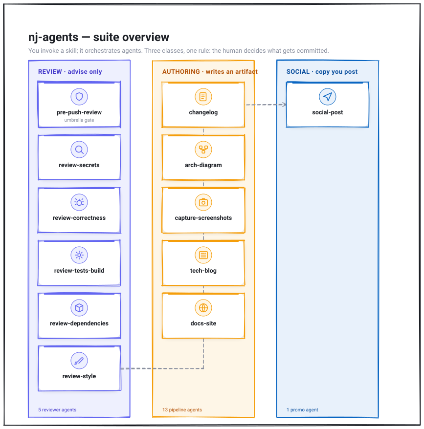

# nj-agents

A personal, project-agnostic collection of Claude Code **skills and agents** for
software-development workflows. Maintained independently and installed into any
project (or globally) via symlink. Designed to grow — new skills/agents drop into
`skills/` and `agents/` and are picked up on the next install.

## Two classes of skill

nj-agents has two kinds of skill, with opposite stances on touching your repo:

- **Review class** — *advise only, leave no files, never commit.* Reads your changes
  and reports. Shared rules: [`CONVENTIONS.md`](CONVENTIONS.md).
- **Authoring class** — *writes an artifact into the repo* (changelog, diagram, blog),
  then **proposes** the commit (never runs `git add`/`commit`/`push`/`tag`). Shared
  rules: [`CONVENTIONS-authoring.md`](CONVENTIONS-authoring.md).

Both share one rule: **the human decides what gets committed.**

## Architecture

How the suite fits together, and the key workflows — see
[`docs/architecture/`](docs/architecture/) for the full set (icon-tile SVGs generated
from JSON models by the suite's own `/arch-diagram`, passed through the `diagram-qa`
visual-QA gate).



## Review suite (review class)

A thorough, AI-assisted review of your *current commit or uncommitted changes* before
you push (or any time, on demand, or from CI). Five dimensions, each a dedicated
skill + agent pair, plus one umbrella that runs them all.

| Skill | What it does | Agent it uses |
|---|---|---|
| `/pre-push-review` | **Umbrella.** Prints the warning banner, runs the secret scan as a gate, then spawns the other dimensions in parallel and aggregates one PASS / WARN / BLOCK verdict + a report artifact. | (orchestrates the below) |
| `/review-secrets` | Secret scan over the diff **first** (hard gate — shares nothing if a key is found), using a **required** dedicated scanner (gitleaks/trufflehog/detect-secrets — BLOCKs with install steps if none is present). Then a semantic security pass. | `secrets-reviewer` |
| `/review-correctness` | Bugs, regressions, edge cases, missing validation in the changed lines and their blast radius. | `correctness-reviewer` |
| `/review-tests-build` | Auto-detects and runs the repo's own test/lint/build commands as a gate. Never installs tooling. | `tests-build-runner` |
| `/review-dependencies` | Added/removed/upgraded packages, version-pinning risk, license changes, supply-chain signals (typosquatting). Diff-only; no network, no install. | `dependency-reviewer` |
| `/review-style` | Consistency with surrounding code, commit-message hygiene, leftover debug/TODO output. | `style-reviewer` |

Each dimension runs standalone; the umbrella runs them together. Shared behavior
(snapshot scope, diff hygiene, findings format, CI mode, report artifact, safety
rails) lives once in [`CONVENTIONS.md`](CONVENTIONS.md).

## Authoring suite (authoring class)

Generates documentation artifacts from your project and places them in the repo, then
proposes the commit. Every skill reads the repo to ground its output — nothing is
invented — and prints a banner before it starts.

| Skill | What it does | Agent(s) it uses |
|---|---|---|
| `/changelog` | Generates/updates `CHANGELOG.md` in **Keep a Changelog** format + SemVer, from your commit history (Conventional Commits as the signal). Suggests the version bump, merges into `[Unreleased]` without clobbering, proposes the commit (+ optional release-only tag). | `changelog-writer` |
| `/arch-diagram` | Reads your README/docs/ADRs, then generates a system/solution/sequence/data-flow/deployment/ER diagram. Default **draw.io + exported SVG** (needs the free draw.io CLI — hard preflight gate offers install or the Excalidraw fallback); mermaid / inline SVG / Figma-via-MCP on request. Places it in `docs/architecture/` and proposes the commit. | `diagram-architect` |
| `/docs-site` | **Multi-agent** universal documentation generator. Builds a self-contained, theme-aware `docs.html` from existing docs, the codebase, an outline, or structured definition files (SKILL.md/OpenAPI/JSON-Schema). Auto-derives the menu from the content, grounds everything in the source (flags gaps rather than inventing), and embeds **auto-redacted** screenshots via `/capture-screenshots`. Proposes the commit. | `docs-architect`, `docs-designer` |
| `/capture-screenshots` | **Multi-agent** capture + **redaction** pipeline. Captures from a running web app (Playwright), terminal/CLI output, a static HTML/component, or existing images; then detects PII/secrets (emails, tokens, keys, phone, cards, names), blurs/masks them (full for high-risk, partial for illustrative), and **verifies coverage before writing** (blocks if unsure). Only the redacted image is committed — the raw stays gitignored. | `screenshot-capturer`, `sensitive-data-reviewer`, `screenshot-redactor` |
| `/tech-blog` | **Multi-agent** pipeline (writer → fact-checker → reviewer → editor → final-polish → platform-lint → optional poster) that writes an expert technical post about the project. The **fact-checker BLOCKS** on any claim it can't verify against the repo. **Generates** the visual assets it needs (arch diagrams via `/arch-diagram`, redacted screenshots via `/capture-screenshots`) alongside the writer, then embeds them; applies an emphasis/terminology/style pass, runs a pre-publish checklist (single-H1, ending, dupes) and a platform lint (Dev.to tags/SVG→PNG/cover), writes to `docs/blog/` + publish-ready MD/HTML, posts via a connected MCP you opt into — or, for Dev.to with no MCP, a direct-REST fallback (`DEVTO_API_KEY`, draft-first). | `blog-writer`, `blog-fact-checker`, `blog-reviewer`, `blog-editor`, `blog-final-polish`, `blog-platform-lint`, `blog-poster` |
| `/scaffold-project` | Lays out a **new** repository to a recognized baseline — the **OpenSSF OSPS Baseline** (Level 1 by default; Level 2 for published/multi-maintainer projects). Grounds the security/governance layer in the baseline (each file cited by control ID, e.g. `OSPS-LE-03.01` → LICENSE) and delegates the stack layout to the ecosystem's own generator (`cargo new`, `uv init`, `npm create`) rather than inventing one. Reads a supplied project doc first. Verifies the result (OpenSSF Scorecard when present, else by-hand control check) before reporting done, then proposes the commit. | (no dedicated agent) |
| `/social-post` | Drafts promo copy (LinkedIn / X) for a **published** post/repo/demo, grounded in the actual content. Short / medium / builder-story variants, hook-first, correct link-preview + first-comment strategy, clean hashtags. Honors style prefs (e.g. no em-dashes). Drafts only — never auto-posts. | `social-post` |

Shared authoring behavior (repo-context ingest, placement, propose-commit,
MCP-detection, grounding/safety) lives once in
[`CONVENTIONS-authoring.md`](CONVENTIONS-authoring.md).

## Workflow suite (workflow class)

Reads the branch's changes and drafts a change artifact — it **proposes and never
auto-acts** (borrowing the safe halves of both other classes: reads a diff like the
review class but invents nothing; proposes like the authoring class but its artifact
is a **PR, not a repo file**).

| Skill | What it does | Agent it uses |
|---|---|---|
| `/pr-describe` | Drafts a **PR title + body** from the branch's whole delta versus its base (the PR view), grounded in the real commits and diff — every line traces to a change, nothing invented. Fills the repo's own `PULL_REQUEST_TEMPLATE.md` when present, else a sensible default (Summary / Changes / Why / Test plan / Related). Opens a **draft** PR only if you opt in and `gh` is present; otherwise hands you the text to paste. **Never pushes, never opens a non-draft PR, never merges.** | `pr-describer` |
| `/commit-assistant` | Drafts **Conventional Commits** message(s) from the working-tree changes and prints the exact `git add` + `git commit` block to run. When the tree holds unrelated changes it proposes **splitting them into separate commits**, one message each; respects changes you've already staged as your stated intent. Matches the repo's own commit style (including a `no Co-Authored-By` rule). Grounded in the diff — no `fix bug` filler. **Never runs git** — the human decides what gets committed. | (no dedicated agent) |
| `/release-notes` | Turns a version's changes into a **draft GitHub Release** — the release object on the Releases page, the one release artifact `/changelog` doesn't produce. Prefers the existing `CHANGELOG.md` section as the notes body (composes with `/changelog`, doesn't duplicate it), else summarizes the commit delta since the last tag. Drafts `gh release create --draft`; falls back to printing the notes + tag commands when `gh` is absent. **Never publishes a release, never pushes a tag.** | (no dedicated agent) |

`gh` is detected, never required (§A5); the print-and-paste path always works.

## PM-authoring suite (PM-authoring class)

Writes a **work item into a project-management tracker** (Linear / Jira / Notion /
GitHub Issues) — the artifact is a tracker object, not a repo file. Tool-agnostic (via a
connected MCP), **draft-first**, MCP-detect-never-require with a **paste-ready-markdown
fallback**, and it **proposes the create — never bulk-creates silently**. Shared rules
in [`CONVENTIONS-pm.md`](CONVENTIONS-pm.md) (§P1–P7).

| Skill | What it does | Agent it uses |
|---|---|---|
| `/pm-epic` | Drafts one **Epic** (goal, problem, success measure, scope / out-of-scope) plus a **suggested** decomposition into candidate stories (a list — it does not create them). On opt-in creates the epic only. To build the whole tree, use `/pm-plan`. | (no dedicated agent) |
| `/pm-story` | Drafts one **INVEST user story** ("As a … I want … so that …") with explicit **acceptance criteria** and an estimate hint; on opt-in creates it in the connected tracker (optional parent Epic), else hands you paste-ready markdown. Grounded in your intent — no invented scope. | (no dedicated agent) |
| `/pm-task` | Drafts one scoped, actionable **Task** (optionally under a parent Story/Epic); on opt-in creates it, else markdown. Keeps it small and single-purpose. | (no dedicated agent) |
| `/pm-plan` | **Orchestrator.** Decomposes a feature-sized ask into an **Epic→Stories→Tasks** tree (via `pm-decomposer`), previews the **whole tree** for one approval, then creates it in the connected tracker **sequentially, parent-first** — Epic, then Stories under it, then Tasks under each — wiring parent links as it goes. **Stops and reports on any partial failure**; searches + reconciles first so a re-run never double-creates. No MCP → the whole tree as markdown. | `pm-decomposer` |

## ⚠️ What it does with your code — read this

**Review suite:** these skills **generate a snapshot of your changes** (the `git diff`
of your staged, unstaged, and committed-but-unpushed work) and **share it with AI** —
the Claude session running the skill, plus the subagents it spawns — to review it.
**No external API is called**; the current session does the analysis. Every skill
prints a banner saying so before it reads anything. **A local secret scan runs before
any snapshot is shared** — on a hit the review **stops and shares nothing** until you
remove it. The review suite **advises only**: it never pushes, commits, bypasses git
hooks, or leaves files in your repo.

**Authoring suite:** these skills read your repo to ground their output and **do write
one artifact into it** (a changelog, diagram, or blog post) at a standard docs
location. They then **propose** the commit — showing you the diff and the exact
`git add`/`commit`/`push` commands — but **never run git themselves**. Posting a blog
externally happens only through an MCP connector you've explicitly opted into, as a
draft, never an auto-publish. Nothing is invented: every fact traces to your repo (the
blog fact-checker blocks on anything it can't verify). Screenshots are **redacted by
default** — PII/secrets are detected and blurred, coverage is verified before the
image is written, and only the redacted version is committed (the raw capture stays in
a gitignored dir).

## Prerequisites

- **Claude Code**, and a **git repository** to review (`git` on PATH).
- **A diff to review** — if there's nothing staged/unstaged/unpushed, the skills
  stop cleanly.
- **No API key required, no network** — the review uses your current Claude session.
- **Required:** a dedicated secret scanner on PATH — [`gitleaks`](https://github.com/gitleaks/gitleaks)
  (MIT), [`trufflehog`](https://github.com/trufflesecurity/trufflehog) (Apache-2.0),
  or [`detect-secrets`](https://github.com/Yelp/detect-secrets) (Apache-2.0) — any
  one. `review-secrets` and the umbrella **BLOCK with install instructions** if none
  is present; there is no heuristic-only fallback. All three are free/open source:
  `brew install gitleaks` (or `trufflehog`), or `pipx install detect-secrets`.
- **Optional:** a test/lint/build command. `review-tests-build` auto-detects it
  (Node/Python/Go/Rust/JVM/Make/just, or a command documented in
  `CLAUDE.md`/`AGENTS.md`). If none exists, that dimension reports SKIP — it never
  invents or installs one.

## Data handling / privacy

Nothing leaves your machine. The suite reads your git diff and analyzes it with the
**Claude session already running** — no external API is called, no third-party
service receives your code. Before any diff is shared even with a subagent, the
secret scan runs; on a hit it stops and shares nothing. Report artifacts are written
outside the repo tree (or under a gitignored dir) and contain **no unmasked
credentials**. See [`CONVENTIONS.md`](CONVENTIONS.md) §3/§6/§7.

## CI / non-interactive use

Set `NJ_AGENTS_CI=1` (or pass `--ci`) to run without prompts, suitable for a
pipeline or git hook. In CI mode the review never waits for confirmation — any
ambiguity resolves to the safe (BLOCK) outcome — and honors an **exit-code
contract**: `0` for PASS/WARN, non-zero for BLOCK. A wired hook or CI step keys off
that code. The suite itself still only advises — it never runs `git push` and never
bypasses a hook.

## Report artifact

Each umbrella run writes a timestamped record — repo, branch, scope reviewed, which
secret scanner ran, files excluded, per-dimension verdicts + findings, and the
aggregate verdict — to `${NJ_AGENTS_REPORT_DIR:-<repo>/.nj-agents-reports}/` (or the
temp dir). It is **never committed**; the umbrella offers to add
`.nj-agents-reports/` to your `.gitignore`.

## Install

Global (all projects):

```bash
./install.sh
```

Per-project (into `DIR/.claude/`):

```bash
./install.sh --project /path/to/your/repo
```

Uninstall (only removes symlinks pointing back into this repo):

```bash
./install.sh --uninstall
./install.sh --project /path/to/your/repo --uninstall
```

Restart / reload Claude Code afterward, then run `/pre-push-review` in any repo.
The installer uses **symlinks**, so editing files here updates every install.

## Optional: gate on `git push`

By default the suite is **manual / on-demand** — nothing auto-fires. If you want it
to gate an actual push, wire one of these **per project** (never globally, and the
suite proposes it, never installs silently):

- **Native git hook** — a `.git/hooks/pre-push` that runs the review and exits
  non-zero on BLOCK. Gates any push by anyone; `git push --no-verify` remains a
  conscious, visible bypass.
- **Claude Code `PreToolUse` hook** — in the project's `.claude/settings.json`,
  matching `Bash(git push*)`, to gate pushes made *through Claude*.

Run `/pre-push-review` and it will offer to set one up.

## Layout

```
nj-agents/
├── skills/<name>/SKILL.md      # each skill is a directory + SKILL.md
├── agents/<name>.md            # each agent is a flat .md
├── CONVENTIONS.md              # shared rules for the review class
├── CONVENTIONS-authoring.md    # shared rules for the authoring class
├── CONVENTIONS-pm.md           # shared rules for the PM-authoring class
├── global/CLAUDE.md            # guidance installed to ~/.claude/CLAUDE.md
├── install.sh                  # symlinks skills/ + agents/ into a .claude/ dir
└── README.md
```

### Global guidance file

Installing the skills makes them *available* everywhere; it doesn't tell Claude
**when** to reach for them. [`global/CLAUDE.md`](global/CLAUDE.md) closes that gap —
`install.sh` symlinks it to `~/.claude/CLAUDE.md`, so every session in every repo
starts knowing the suite exists, what each skill covers, and the standing rules
(propose-commit, ground-in-repo, degrade-don't-fail, scoped output).

It is **advisory** — it suggests the right skill, it never auto-fires one. A
project's own `CLAUDE.md` takes precedence, and the installer **never overwrites**
an existing non-symlink `CLAUDE.md` (relevant for `--project`, where it would
otherwise collide). `--uninstall` removes it.

Unlike `skills/` and `agents/` — which the installer **globs**, so new files are
picked up automatically — this file lists skills **by hand** (it is curated prose,
not generated). A skill missing from it still installs, but stays invisible in other
repos. So `install.sh` diffs the tables against what actually ships and warns:

```bash
./install.sh --check-only    # check sync without installing anything
```

```
  ! global/CLAUDE.md is out of sync with skills/:
      not listed (invisible in other repos): commit-assistant
```

The warning is **advisory** — it never edits the file and never fails the install.

## Adding more

Drop a new skill directory under `skills/` (with a `SKILL.md`) or a new agent `.md`
under `agents/`, then re-run `./install.sh`. Keep everything **project-agnostic** —
discover per-repo details at runtime rather than hardcoding a stack, path, port, or
tool. Point each new skill at the right class contract: `CONVENTIONS.md` if it only
reads and advises, `CONVENTIONS-authoring.md` if it writes an artifact into the repo,
`CONVENTIONS-pm.md` if it writes a work item into a project-management tracker.
