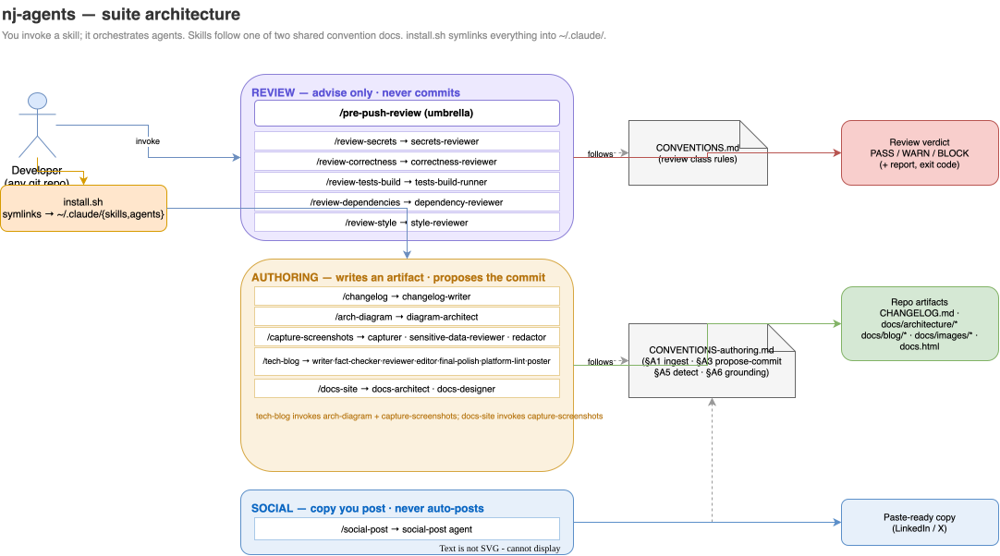
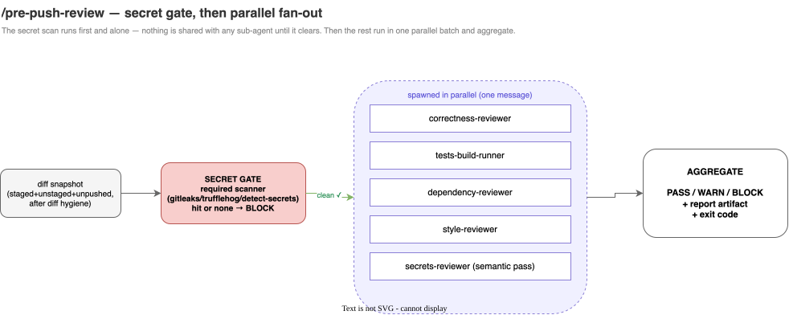
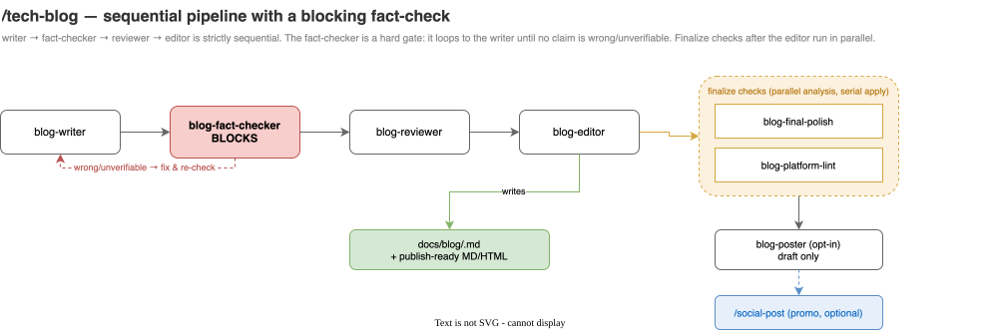
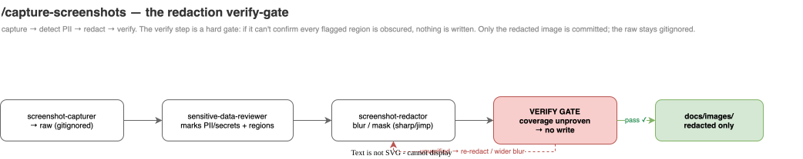

# nj-agents — architecture

Diagrams of the suite and its key workflows. Each is an editable **draw.io** source
(`.drawio`) with an exported **SVG** committed alongside it — the SVG renders here and
on GitHub; open the `.drawio` at [app.diagrams.net](https://app.diagrams.net) or with
the VS Code *Draw.io Integration* extension to edit.

> These were generated by the suite's own `/arch-diagram` skill (draw.io default),
> grounded in the actual `skills/*/SKILL.md` and `agents/*.md` definitions.

## Suite architecture

How it fits together: you invoke a skill; it orchestrates agents. Skills belong to one
of three classes and follow one of two shared convention docs. `install.sh` symlinks
everything into `~/.claude/`.

[Edit source →](./system-arch.drawio)

## Workflows

### /pre-push-review — secret gate, then parallel fan-out
The secret scan runs first and alone; nothing is shared with a sub-agent until it
clears. Then the remaining dimensions run in one parallel batch and aggregate to a
single verdict.

[Edit source →](./workflow-pre-push-review.drawio)

### /tech-blog — sequential pipeline with a blocking fact-check
writer → fact-checker → reviewer → editor is strictly sequential. The fact-checker is a
hard gate that loops back to the writer until no claim is wrong or unverifiable. The
finalize checks after the editor run in parallel, then the optional poster and promo.

[Edit source →](./workflow-tech-blog.drawio)

### /capture-screenshots — the redaction verify-gate
capture → detect PII → redact → **verify**. The verify step is a hard gate: if it can't
confirm every flagged region is obscured, nothing is written. Only the redacted image
is committed; the raw stays in a gitignored dir.

[Edit source →](./workflow-capture-screenshots.drawio)

---

*Regenerate any of these with `/arch-diagram` (draw.io default). The full browsable
reference for all skills and agents is [`docs.html`](../../docs.html).*
