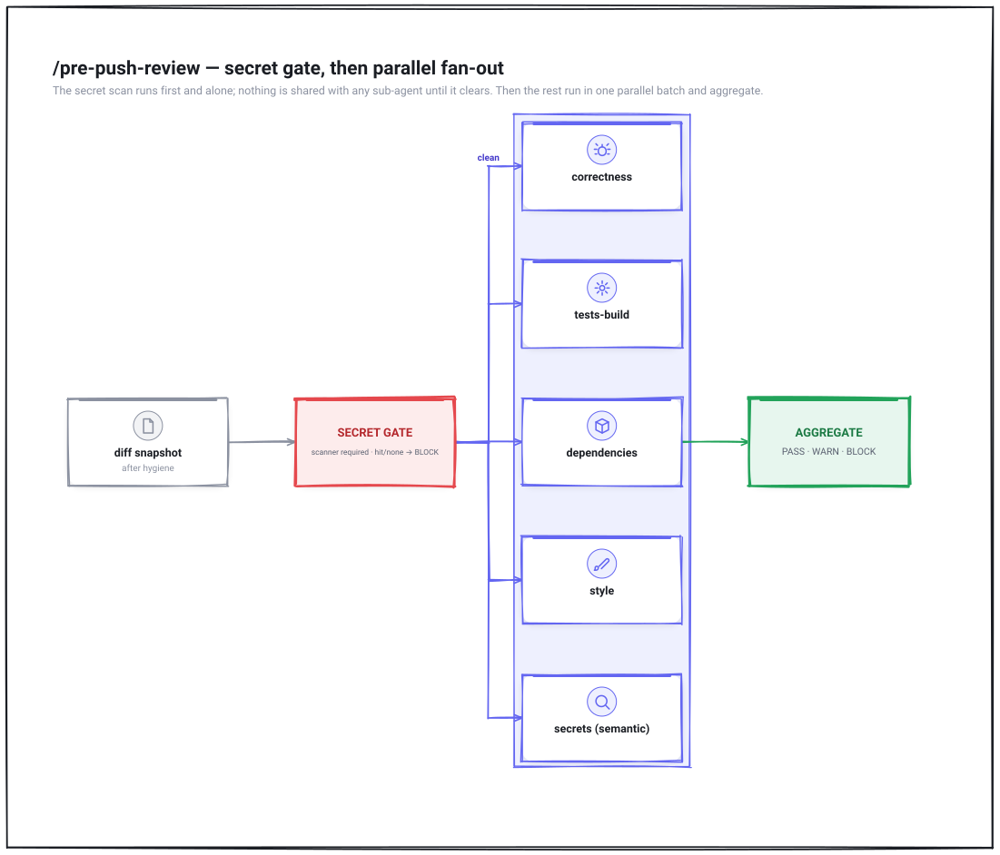
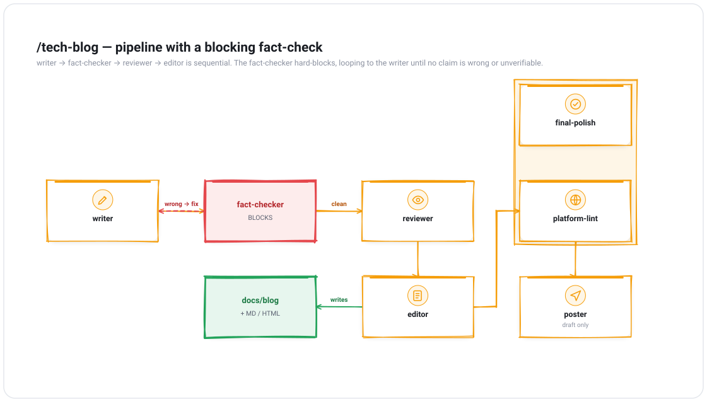
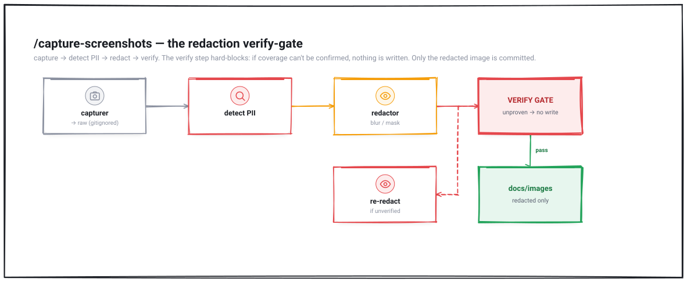

# nj-agents — architecture

Diagrams of the suite and its key workflows, authored directly as SVG —
generated by the suite's own `/arch-diagram` skill from a small JSON model, rendered
to a self-contained **SVG** (committed alongside a `.png`), and passed through the
enforced `diagram-qa` visual-QA gate. Everything is grounded in the actual
`skills/*/SKILL.md` and `agents/*.md` definitions.

> **Edit source** = the diagram's `*.iconmodel.json` / `*.flowmodel.json` model. Change
> it, then re-render: `node ../../skills/arch-diagram/scripts/{icon,flow}_diagram.js
> <model.json> <out.svg>` (run `npm install` in that `scripts/` dir once). The
> `diagram-qa` gate re-checks it.

## Suite architecture

How it fits together: you invoke a skill; it orchestrates agents. Skills belong to one
of three classes (review / authoring / social) and follow one of two shared convention
docs. `install.sh` symlinks everything into `~/.claude/`.

[Edit source →](./suite-overview.iconmodel.json)

## Workflows

### /pre-push-review — secret gate, then parallel fan-out
The secret scan runs first and alone; nothing is shared with a sub-agent until it
clears. Then the remaining dimensions run in one parallel batch and aggregate to a
single verdict.

[Edit source →](./workflow-pre-push.flowmodel.json)

### /tech-blog — sequential pipeline with a blocking fact-check
writer → fact-checker → reviewer → editor is strictly sequential. The fact-checker is a
hard gate that loops back to the writer until no claim is wrong or unverifiable. The
finalize checks after the editor run in parallel, then the optional poster and promo.

[Edit source →](./workflow-tech-blog.flowmodel.json)

### /capture-screenshots — the redaction verify-gate
capture → detect PII → redact → **verify**. The verify step is a hard gate: if it can't
confirm every flagged region is obscured, nothing is written. Only the redacted image
is committed; the raw stays in a gitignored dir.

[Edit source →](./workflow-capture-screenshots.flowmodel.json)

---

*Regenerate any of these with `/arch-diagram`. Semantic color is enforced (red =
failure/block, green = success/pass). The full browsable reference for all skills and
agents is [`docs.html`](../../docs.html).*
